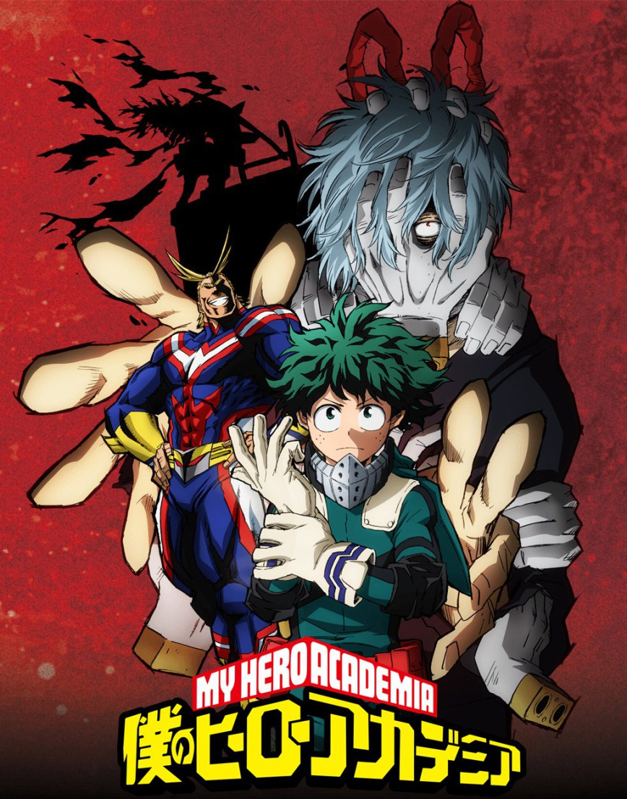

<html xmlns="http://www.w3.org/1999/xhtml">
<head>
    <link href="https://cdn.jsdelivr.net/npm/bootstrap@5.1.3/dist/css/bootstrap.min.css" rel="stylesheet" integrity="sha384-1BmE4kWBq78iYhFldvKuhfTAU6auU8tT94WrHftjDbrCEXSU1oBoqyl2QvZ6jIW3" crossorigin="anonymous">

    <title>Главная</title>

    <link href="1.css" rel="stylesheet" />
</head>
<body>
    <nav class="navbar navbar-expand-lg navbar-black bg-violete">
        

            <button class="navbar-toggler" type="button" data-bs-toggle="collapse" data-bs-target="#navbarTogglerDemo01" aria-controls="navbarTogglerDemo01" aria-expanded="false" aria-label="Toggle navigation">
                
            </button>
            

                <a class="navbar-brand" href="https://jut.su/kami-tou/">Аниме</a>
                <ul class="navbar-nav me-auto mb-2 mb-lg-0">

                    <li class="nav-item">
                        <a class="nav-link active" aria-current="page" href="https://mangalib.me/?hl=ru_RU">Манга</a>
                    </li>

                    <li class="nav-item">
                        <a class="nav-link" href="https://animeshop-akki.ru/cospley/">Косплей</a>
                    </li>

                    <li class="nav-item">
                        <a class="nav-link disabled" href="https://ranobelib.me/" tabindex="-1" aria-disabled="true">Литература</a>
                    </li>
                </ul>
                <form class="d-flex">
                    <input class="form-control me-2" type="search" placeholder="Search" aria-label="Search">
                    <button class="btn btn-outline-success" type="submit">Поиск</button>
                </form>
            

        

    </nav>
    <h2>Книжный магазин "Няпи"</h2>

    <ul id="navbar">
        <li><a href="главная.html"target="_blank"> Главная</a></li>
        <li><a href="Новинки.html"target="_blank">Новинки</a></li>
        <li><a href="Каталог.html"target="_blank">Каталог</a></li>
        <li><a href="Форма.html"target="_blank">Форма заказа</a></li>
        <li><a href="контакты.html"target="_blank">Контакты</a></li>
    </ul>

Популярное
 
         
         
         
        
    

 
Гарантированная доставка по всей России.
 

Большой ассортимент.

Бесплатная доставка при заказе от 2999р!

Приходят ко мне и дельфины, говорят со мной, и я их понимаю. Жалуются: "Под нами становится слишком горячо. Мы уже не выдерживаем....
  (Ванга тыкается)

  

  

 Информация о навинках японской литературы и манги. На нашем сайте вы точно подберете себе литературу по вкусу. Описание лучшей манги, вышедшей в этом году. Ваши любимые произведения - только у нас!
   

Анимешник, Гик или любитель К-поп – это ты? Тогда ты попал по адресу!
   

В нашем аниме магазине есть все! Широкий ассортимент одежды, линзы, оригинальные аниме фигурки и парики для косплея, цветная краска для волос и дакимакура. Свыше 500 видов карнавальных линз: зеленые, голубые, черные и прочих цветов. Есть все виды аниме и корейских линз, увеличивающих глаза.

Пижамы кигуруми подойдут как для сна или занятий спортом, так и для аниме фестиваля или вечеринки, их еще называют аниме и к-поп пати.

Новый товар мы завозим каждую неделю, особенно по таким аниме и к-поп группам как: наруто, токийский гуль, атака титанов, геройская академия, покемоны, пикачу, вокалоиды, хатсунемику,jojo, deathnote, onepiece, yurionice, коносуба, милый во франксе, бродячие псы, евангелион, сейлормун, унесенные призраками и другие произведения миядзаки, bts, mostax, exo, bingbang, twice, gerlsgeneration.

DCи Марвел мы стороной не обошли: наушники, школьные рюкзаки, тетради, плакаты, брелоки и фигурки – все это вы можете купить в нашем магазине или заказать доставку.

Наушники в нашем магазине проходят проверку перед продажей и подлежат возврату /обмену в течение 14ти дней с момента покупки.

Маски, Киги (kigurumi) и цветные, яркие парики отлично дополнят ваш косплей. В наличии Розовые парики, голубые и синие, зеленые и прочие цвета.

Билеты на аниме вечеринки и фестивали можно купить как в самом магазине в Москве так и на сайте аниме, гик и к-поп магазина Няпи. В продаже подарочные сертификаты на день рождения, новый год и любой другой праздник.

  

  
  

    
	

        
Работу выполнила Колесникова Ева, ИСП-6

    

  
    

</body>
</html>
